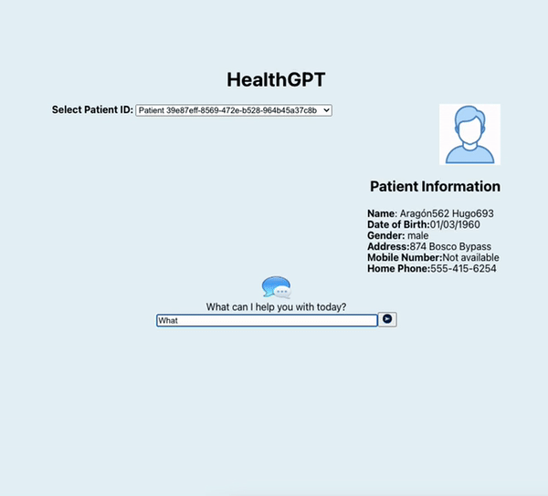

# Technical User Manual

## React.js based Medical ChatGPT integrated with Langchain and Vector-storage

This is a RAG application built on Node JS/React js integrated with ChatGPT and running with LangChain. The application allows users to interact with a ChatGPT model using natural language with the Patient information retreived from HAPI FHIR services. This application uses
For LLM Model: Open AI -gpt-=.X-turbo
For Embeddings: Open AI - text-embedding-ada-DDZ
For Vector DB: vector-storage

## Features

- Chat with ChatGPT: Interact with a ChatGPT model using natural language.
- React.js UI: User-friendly interface built with React.js.
- Integrated with LangChain: Powered by LangChain for advanced language processing capabilities.
- Integrated with vector-storage Vector DB.
- Deployed with Vercel: Both client and server configurations deployed on Vercel for easy access.

## Vector DB Integration
- The following information is retrieved from the HAPI FHIR portal :
  - Biographical information
  - Medicines/drugs prescribed information
  - Procedures applied to the patient
  - Observations recorded for the patient.
- The above patient information is pushed to Vector storage DB with following categories : 
   - Biographical information  -- Category **Bio**
  - Medicines/drugs prescribed information -- Category **Medicines**
  - Procedures applied to the patient -- Category **Procedures**
  - Observations recorded for the patient. -- Category **Observations**

This data stored in vector DB is passed thru the similarity search and the output chunk is passed to chatbot for a answer back.

# Deployment Steps

@ravi to provide actual CI/CD Steps

1. Clone the repository:
-   git clone https://github.gatech.edu/rkrishna48/healthgpt/

2. Navigate to the project directory:

-   cd healthgpt

3. Server and Client components in Vercel

-   The vercel project is created under : https://vercel.com/ravis-projects-389f4c4b
-   Server component is named as healthgptvercel-server
-   Client server is named as healthgptvercel-client

4. Start the development client:

5. Open your browser and navigate to `https://healthgptvercel-client1.vercel.app` to view the application.

# User Instructions

1. Visit the deployed application URL: https://healthgptvercel-client1.vercel.app.
2. You will have an option to select the Patients.
3. You will see the selected patient base data on the righthand side .
4. You will see a chat interface.
5. Type your message in the input box and press Enter to send it to ChatGPT.
6. ChatGPT will respond with a natural language response.
7. Continue the conversation by typing more messages.

# Special Instructions

1. Select any patient from the drop down to see the basic demographic information of the patient
2. You can use the chatbot to ask about any demographic information, Medication, Procedure and Observations.
3. Sample questions - Please tell the Date or Birth of the patient, Please tell the medication information for the patient, Please tell all the observations for the patient etc. It should give you Patient specific details for your question.

** Note : All the resources on HAPI FHIR test sever have all the information as this is test data. The app should won't be able to return the results if the information is not available on HAPI FHIR Test server

## Dependencies

- React.js: JavaScript library for building user interfaces.
- LangChain: Advanced language processing platform for integrating natural language capabilities into applications.
- ChatGPT: OpenAI's ChatGPT model for generating human-like text responses.
- Vector DB: vector-storage NPM package provides the integration for Vector DB storage.
- Vercel: Platform for deploying web applications and serverless functions.

## Contributing

Contributions are welcome! If you find any bugs or have suggestions for improvements, please feel free to open an issue or submit a pull request.

