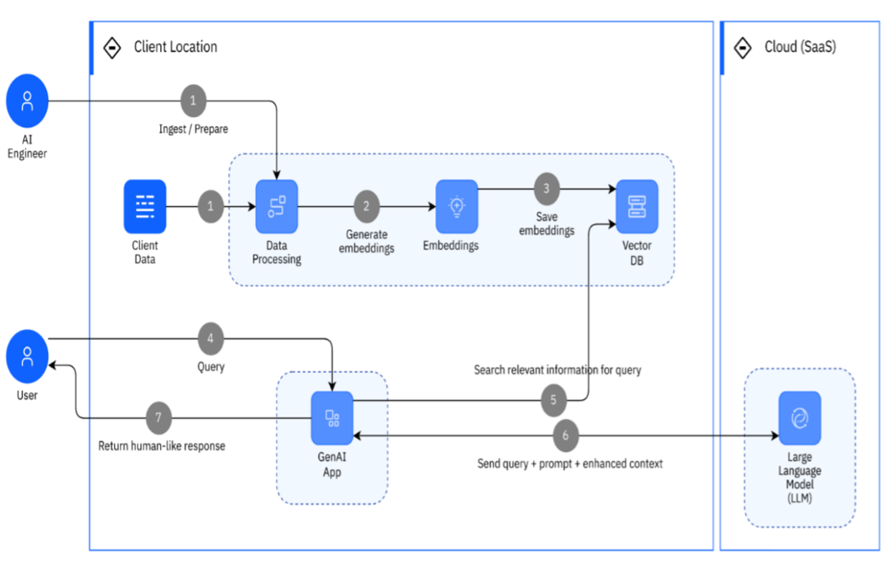

# Health GPT - A medical chatbot
**Project for CS6440 TEAM 24**

The Health GPT chatbot is your personalized health assistant, powered by advanced GenAI. It simplifies accessing healthcare information by understanding natural language queries, offering prompt responses, and providing comprehensive insights. With its intuitive interface and cutting-edge technology, Health GPT empowers users to make informed decisions and promotes better health outcomes.

## Technical User Manual

[Techincal User Manual](./Documentation/README.md)

## Research

[Research](./Documentation/Research.md)

## Architechure Diagram

[Architecture Diagram Link](./Documentation/ArchitectureDiagram.png)

## Team

* Ravichandran Krishnamurthy (rkrishna48) -  Front Developer and Cloud Engineer
* Varun Saxena (vsaxena34) – Cloud Developer, Backend Developer, Gen AI skills  
* Pramod Misra (pmisra30) - Back-end Developer, Machine learning  
* Sachin K Sharma (ssharma678) - Product Owner, ML/AI Engineer 
* Courtney D Simpson (csimpson61) - Front end developer

